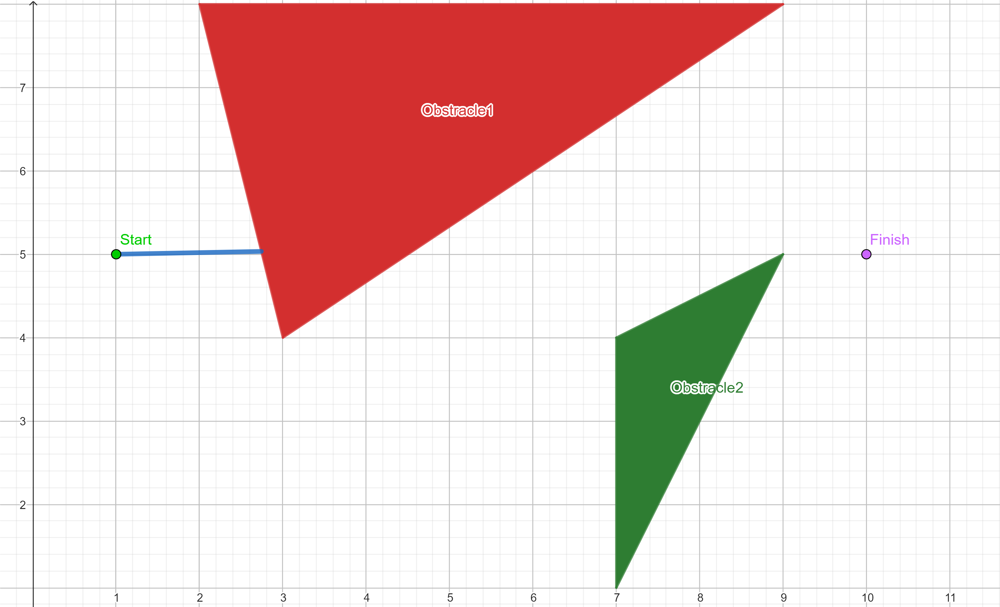
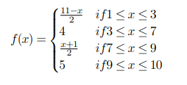
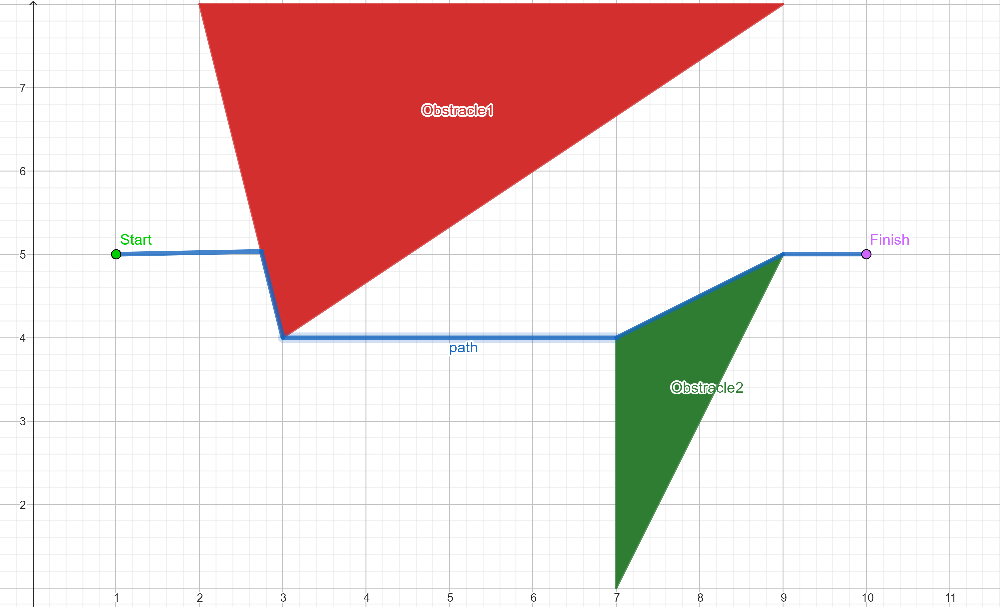
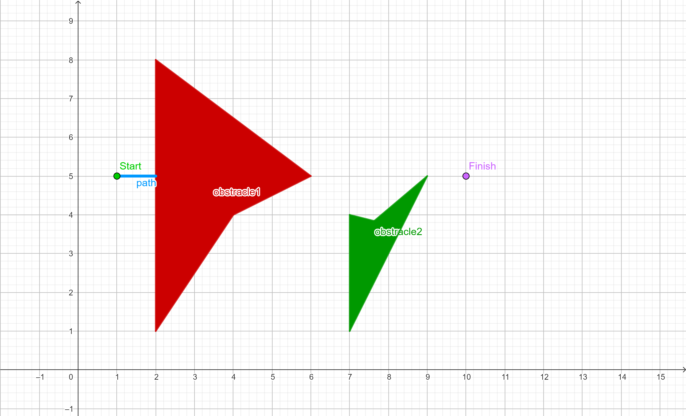

# Robot-Navigation

## Question 1
**Assumptions**
- plane is infinite(containing infinte points) 

**Number of States:**
- The state space consists of all positions (x, y) in the plane.
- Since the plane is infinite, there are infinitely many possible positions.
- Therefore, the number of states is infinite.

**Number of Paths to the Goal:**
- Let's assume that the goal is to reach a specific point (x_goal, y_goal) in the plane.
- We need to consider the obstacles in the plane while calculating paths.
- There are two obstacles in the plane.
- To reach the goal, we can have multiple paths: one that avoids the first obstacle and one that avoids the second obstacle.
- For each of these paths, we can have infinitely many subpaths since the plane is infinite.
- Therefore, there are infinitely many paths to the goal.

## Question 2

- The most direct path between two points is typically a straight line. However, when obstacles or hindrances make a straight path impractical, the next best option is to navigate through a series of connected line segments. These segments are selected to deviate from a straight line as minimally as possible, aiming for the shortest alternative route.

- In practical terms, this means that when faced with barriers or challenging terrain, the objective is to discover a path that minimizes deviation from a straight line to the greatest extent possible. This strategy optimizes efficiency in travel and reduces the total distance traveled while efficiently maneuvering around obstacles.

    
    
    
    

The successor function is as follows:

    

  

  

## Question 5

- In geometry and mathematics, a shape or region is considered non-convex if it does not possess the property of convexity. Convexity characterizes a set of points in Euclidean space where any line segment connecting two points within the set remains entirely within the set itself. Essentially, a shape is convex if, for any two points within the shape, all points along the straight line connecting them are also within the shape.

- Non-convex obstacles present a challenge for hill-climbing algorithms as they can trap the algorithm in local minima (in this context). This situation hampers the algorithm's ability to discover optimal paths. In scenarios involving non-convex obstacles, like narrow passages or grooves, the algorithm may initially progress well but can become stuck in these constrained regions. It often fails to recognize that better paths may exist beyond the immediate vicinity, resulting in suboptimal solutions. This limitation stems from hill climbing's reliance on local information, preventing it from considering paths beyond nearby obstacles. Consequently, non-convex obstacles pose significant challenges, showcasing how local minima can obstruct the algorithm from reaching global optima in path planning problems.

  

  

- In this modified scenario, minor adjustments have been made to introduce a non-convex obstacle. When the agent encounters this obstacle, it finds itself restricted to exploring a semicircular neighborhood. This limitation arises because the other half of the neighborhood is within the obstacle, making it inaccessible.

- In this constrained position, the agent faces a dilemma. Any movement it makes results in an increase in the Euclidean distance to the goal, contradicting its objective of moving closer to the goal. Consequently, the agent becomes immobilized and unable to progress further.

- The resolution to this challenge lies in adopting a different optimization approach, such as simulated annealing. Simulated annealing allows for more flexible exploration by occasionally accepting moves that increase the objective function (distance to the goal) to escape local minima, like the one encountered here. This flexibility enables the agent to navigate effectively through complex environments with non-convex obstacles, providing a promising solution to this problem.
